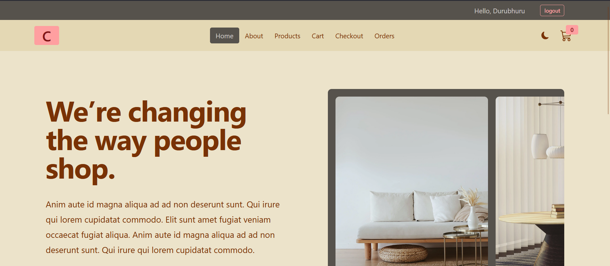
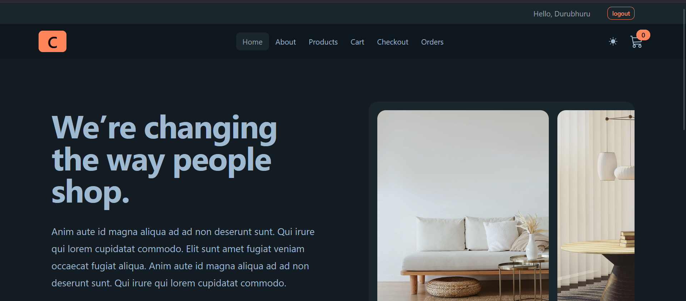
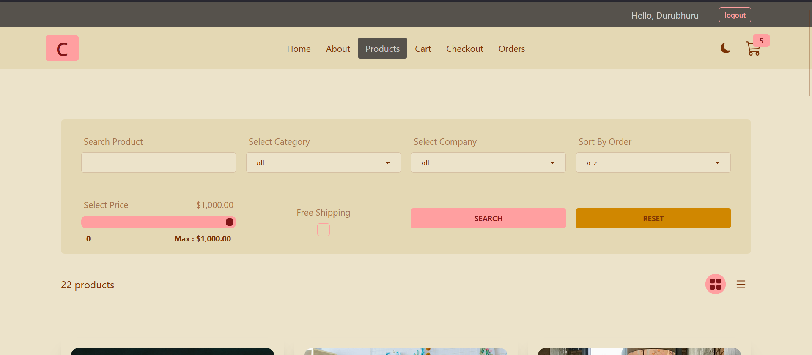
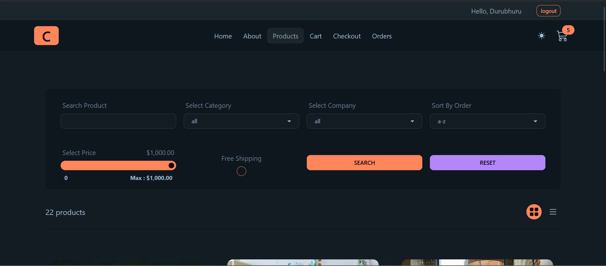

# 🛒 Comfy Store – React E-commerce App

A responsive e-commerce frontend built with **React**, **React Router**, **Redux Toolkit**, and **React Query**. This project simulates a complete shopping experience — browse products, manage your cart, place orders — using a **prebuilt backend API** provided in the tutorial.

---

## 🎓 Built While Following

📚 [React Tutorial and Projects Course](https://www.udemy.com/course/react-tutorial-and-projects-course/)
👨‍🏫 by **Jānis Smilga** on Udemy

---

## 🔗 API Documentation

This project uses a pre-hosted backend:
📄 [Comfy Sloth API on Postman](https://documenter.getpostman.com/view/18152321/2s9Xy5KpTi)

---

## 🚀 Tech Stack

- ⚛️ React 19
- 📦 Redux Toolkit
- 🌐 React Router v6
- 🔁 React Query (TanStack Query v5)
- 💅 Tailwind CSS & DaisyUI
- ⚡ Axios
- 📆 Day.js
- 🛠 Vite

---

## 📁 Folder Structure

```bash
.
├── public/
├── src/
│ ├── assets/ # Hero images
│ ├── components/ # Reusable UI components
│ ├── features/ # Redux slices
│ ├── pages/ # Route components
│ ├── utils/ # Utility helpers
│ ├── App.jsx # App + routing + React Query setup
│ ├── main.jsx # Entry point
│ ├── store.js # Redux store
│ └── index.css # TailwindCSS setup
├── vite.config.js
└── package.json
```


---

## ⚙️ Setup & Installation

1. **Clone this repo**
   ```bash
   git clone https://github.com/Durubhuru14/comfy-store.git
   cd comfy-store
   ```

2. **Install dependencies**
    ```bash
    npm install
    ```

3. **Start development server**
    ```bash
    npm run dev
    ```
> [!WARNING]
> Make sure the backend API is running (or reachable) from the link above. No local backend setup is required.

## 🛍️ Features
  - 💡 Product filtering, sorting, and pagination
  - 🛒 Full cart functionality
  - ✅ Checkout with form validation
  - 🔐 Authentication (login/register)
  - 📦 Order history
  - 🌐 Dynamic routing with React Router
  - 🔄 React Query for data fetching & caching
  - ⚙️ Global state with Redux Toolkit
  - 💅 Responsive UI with TailwindCSS and DaisyUI
  - 💥 Error boundaries per route
  - 🌗 Light/Dark mode ready (DaisyUI theme-based)

## 🖼️ Screenshots

| Light Mode                                     | Dark Mode                                    |
| ---------------------------------------------- | -------------------------------------------- |
|       |       |
|  |  |

## 🧪 Scripts

```bash
npm run dev       # Start dev server
npm run build     # Build for production
npm run preview   # Preview production build
npm run lint      # Run ESLint checks
```
## 🐣 Author

**Durvesh More** (Online alias: **Durubhuru**)
🎓 Computer Science Undergrad (2027) | University of Mumbai

### 🌐 Connect With Me

📧 **Email**: [durveshmore.drm@gmail.com](mailto:durveshmore.drm@gmail.com) \
🔗 **GitHub**: [Durubhuru14](https://github.com/Durubhuru14) \
💼 **LinkedIn**: [Durvesh More](https://www.linkedin.com/in/durvesh-more-1016ab282) \
📸 **Instagram**: [@durubhuru](https://www.instagram.com/durubhuru/)

---

Made with ❤️ by **Durubhuru**
